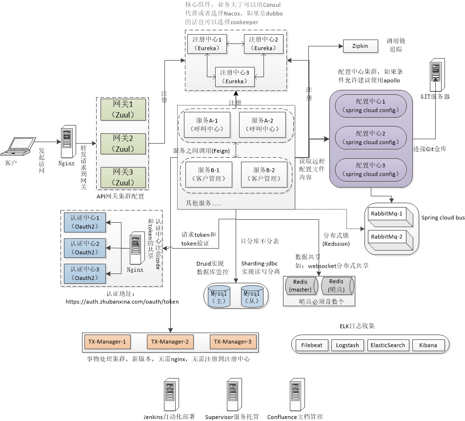

# online_edu
**博客地址：**
[我的CSDN博客](https://blog.csdn.net/zhuwei_clark/ "大仙的博客")  
里面有一些异常的解决方法   
**项目架构图：**

**项目结构说明：**  
online_edu  
   |  
   |_ _ _ online_edu_com  公共模块，提供公共的工具类实体类  
   |  
   |_ _ _ online_edu_eureka 注册中心  
   |  
   |_ _ _ online_edu_config  配置中心  
   |  
   |_ _ _ online_edu_oauth2_config oauth2抽象配置  
   |  
   |_ _ _ online_edu_oauth 认证中心，并提供用户信息接口  
   |  
   |_ _ _ online_edu_user 用户中心，提供用户服务和权限接口  
   |  
   |_ _ _ online_edu_gateway 网关，不做权限验证，只验证是否存在Authorization  
   |  
   |_ _ _ online_edu_customer 客户模块，客户业务模块  
   |  
   |_ _ _ online_edu_student 学生模块，学生业务模块  
 
